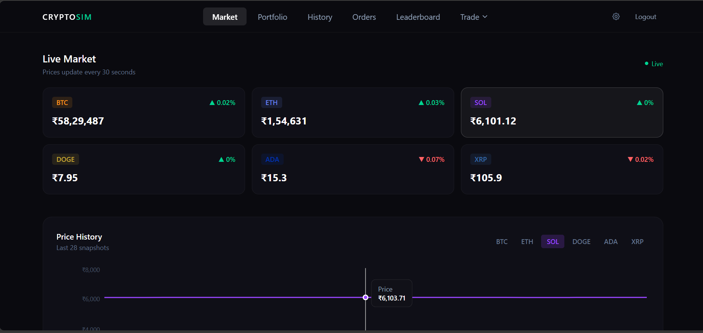
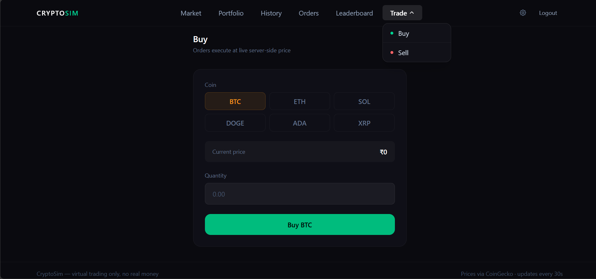
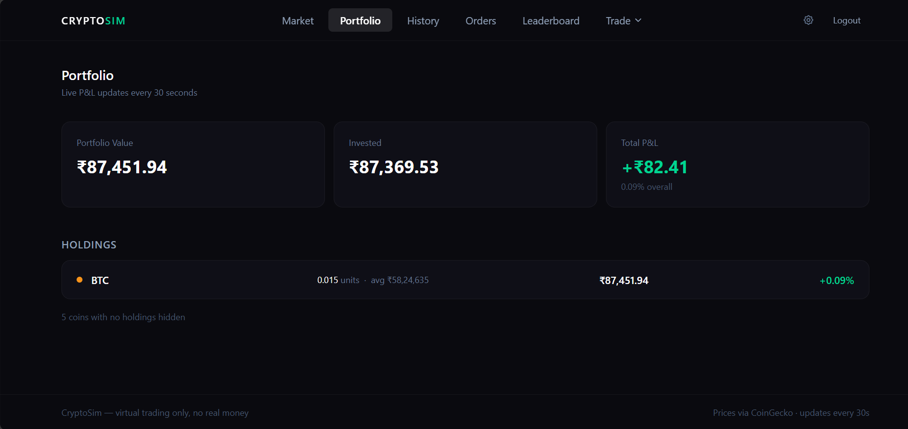
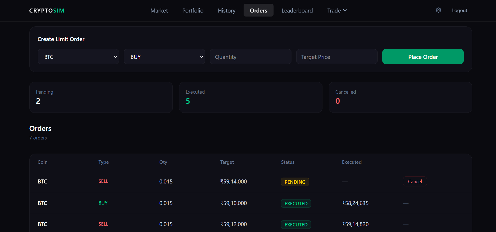
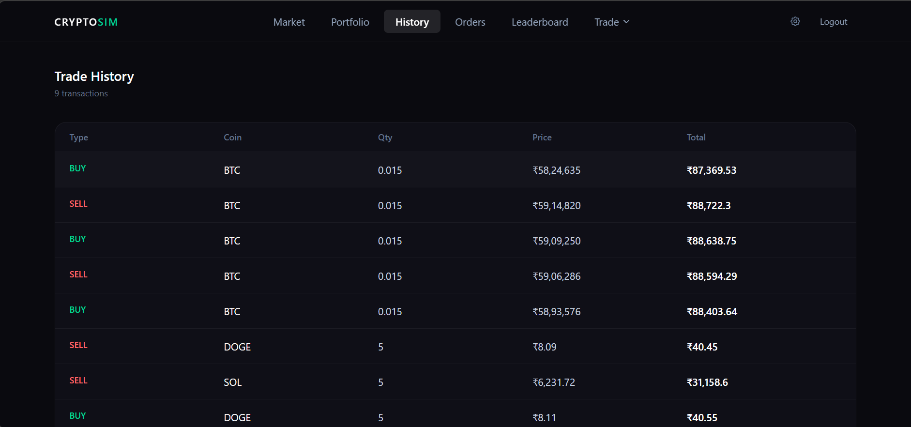
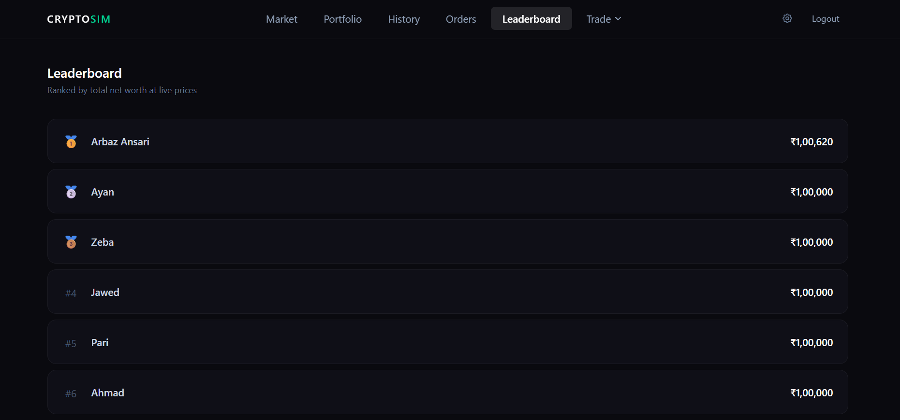

# CryptoSim — Crypto Trading Simulator


A real-time crypto trading simulator built with the MERN stack and Socket.IO. Every user starts with ₹1,00,000 virtual money and trades live coin prices fetched from CoinGecko every 30 seconds. Place market orders or set limit orders that auto-execute when the price hits your target. No real money. Real market behaviour.

🔴 [Live Demo](https://cryptosim-gamma.vercel.app/) | [⌥ GitHub](https://github.com/arbazansari7933/CryptoSim)

---
## Screenshots

### Dashboard


### Trade


### Portfolio


### Orders


### Transaction History


### Leaderboard


## Features

- Real-time crypto prices via CoinGecko
- Market Buy/Sell orders
- Automated Limit Orders
- Live Portfolio Tracking
- Transaction History
- Leaderboard Rankings
- JWT Authentication
- Socket.IO Real-time Updates

## The Problem This Solves

Learning to trade crypto with real money is risky — one wrong trade and you lose thousands. Beginners need a way to understand how markets move, how portfolio value changes in real time, and how to think about buy/sell decisions — without any financial risk.

CryptoSim gives you a real trading experience:
- Live prices from CoinGecko, not mocked or static data
- Your portfolio value updates every 30 seconds as markets move
- Set a limit order and walk away — it executes automatically when the price hits
- Every trade decision has a consequence — your leaderboard rank changes in real time
- Reset your account anytime and start fresh with ₹1,00,000

---

## What it does

**Live Market Prices** — Dashboard shows real-time INR prices for BTC, ETH, SOL, DOGE, ADA, and XRP. Prices are fetched from CoinGecko every 30 seconds and broadcast to every connected client via Socket.IO — no polling from the frontend, no page refresh needed. Price change % (▲/▼) shown on each coin card.

**Price History Chart** — Last 30 price snapshots per coin stored in server memory. On connect, the server immediately sends the full history so the chart never loads empty. Switch between coins via dropdown to see each coin's recent movement.

**Market Orders (Buy/Sell)** — Trade any of the 6 coins instantly at the current live price. The backend reads the price from in-memory market state at the exact moment of the trade — not from the frontend request — so the price is always accurate and cannot be manipulated.

**Limit Orders** — Place a pending order at a target price. The market engine checks all pending orders every 30 seconds against live prices and auto-executes when the condition is met:
- BUY limit → executes when market price **falls to or below** target
- SELL limit → executes when market price **rises to or above** target

Orders page shows full list with status (PENDING / EXECUTED / CANCELLED), target price, and the actual executed price. Pending orders can be cancelled anytime.

**Portfolio with Live P&L** — Shows quantity held and average buy price per coin. Current value and profit/loss updates in real time as socket prices arrive.

**Trade History** — Every market order and executed limit order recorded as a transaction — coin, type, quantity, price at execution, and total amount.

**Leaderboard** — All users ranked by total net worth (wallet balance + current portfolio value at live prices across all 6 coins). Calculated dynamically on request.

**Account Reset** — Settings page lets users reset wallet back to ₹1,00,000, zero out all portfolio holdings, and clear transaction history. Useful for starting a fresh simulation.

**JWT Auth** — Register and login with email/password. JWT token passed to Socket.IO handshake so WebSocket connections are authenticated the same way as HTTP requests. Unauthenticated sockets are rejected before receiving any data.

---

## Tech stack

| Layer | Technology |
|---|---|
| Frontend | React.js 19, React Router v7, Tailwind CSS v4, Vite |
| Backend | Node.js, Express.js v5 |
| Database | MongoDB, Mongoose |
| Real-time | Socket.IO (server + client) |
| Charts | Recharts (LineChart) |
| Market Data | CoinGecko public API |
| Auth | JWT, bcryptjs |
| HTTP Client | Axios |

---

## Architecture

### How live prices reach every user simultaneously

CoinGecko is polled every 30 seconds on the server. The result updates an in-memory `marketState` object and a `marketHistory` array (last 30 snapshots). After each update, both are broadcast to every connected socket client in a single emit.

```
[CoinGecko API] ──── every 30s ────▶ marketEngine.js
                                           │
                              ┌────────────┴────────────┐
                        marketState{}             marketHistory{}
                      (current prices)         (last 30 snapshots)
                              │
                    io.emit("marketUpdate", marketState)
                    io.emit("marketHistory", marketHistory)
                              │
                 ┌────────────┴────────────┐
            [User A]                  [User B]
         setMarket(data)           setMarket(data)
```

When a new user connects, they immediately receive both via direct `socket.emit` — dashboard and chart never load empty.

### How the limit order engine works

After every CoinGecko fetch, the engine runs the order matcher before broadcasting prices:

```
Prices updated
    │
    ▼
Order.find({ status: "PENDING" })
    │
For each pending order:
    │
    ├── BUY order: currentPrice <= targetPrice?
    │       → check wallet balance
    │       → deduct cost from wallet
    │       → update portfolio quantity + avgBuyPrice
    │       → create Transaction record
    │       → mark order EXECUTED with executedPrice + executedAt
    │
    └── SELL order: currentPrice >= targetPrice?
            → check portfolio has enough coins
            → add sale value to wallet
            → reduce portfolio quantity
            → create Transaction record
            → mark order EXECUTED
    │
io.emit prices to all users
```

This runs every 30 seconds — the same interval as price fetching. No separate cron job needed.

### How trades use server-side price, not frontend price

When a buy or sell request hits the backend, price is read from `marketState` at that moment — the request body price is never trusted:

```js
const currentPrice = marketState[coin]; // always from server memory
const cost = currentPrice * quantity;
```

This prevents any client from manipulating the price in the request body.

### How average buy price stays accurate

Each portfolio entry stores a running weighted average across all purchases:

```js
const newAvgPrice =
  (oldQuantity * oldAvgPrice + quantity * currentPrice) / totalQuantity;
```

Works correctly for both market orders and auto-executed limit orders — the same formula is used in both `tradeController.js` and `marketEngine.js`.

---

## Project structure

```
CryptoSim-main/
├── backend/
│   ├── config/
│   │   └── db.js                  # MongoDB connection + dotenv
│   ├── controllers/
│   │   ├── authController.js      # register (auto portfolio create), login, getMe
│   │   ├── tradeController.js     # buy, sell (server-side price)
│   │   ├── orderController.js     # placeOrder, getOrders, cancelOrder
│   │   ├── walletController.js    # resetWallet (balance + portfolio + history)
│   │   ├── PortfolioController.js
│   │   ├── transactionController.js
│   │   └── leaderboardController.js
│   ├── middleware/
│   │   └── authMiddleware.js      # JWT verification, req.user attach
│   ├── models/
│   │   ├── User.js                # name, email, password, walletBalance
│   │   ├── Portfolio.js           # per-coin { quantity, avgBuyPrice } — all 6 coins
│   │   ├── Transaction.js         # userId, coin, type, quantity, price, totalAmount
│   │   └── Order.js               # userId, coin, type, quantity, targetPrice, status, executedPrice, executedAt
│   ├── routes/                    # auth, trade, portfolio, transactions, leaderboard, orders, reset
│   ├── market/
│   │   ├── marketState.js         # in-memory price store + history arrays
│   │   └── marketEngine.js        # CoinGecko polling + limit order matching + Socket.IO broadcast
│   └── server.js                  # Express + Socket.IO setup + JWT socket middleware
│
└── frontend/
    └── src/
        ├── pages/
        │   ├── Dashboard.jsx      # live prices + price change % + history chart
        │   ├── Portfolio.jsx      # holdings + avg buy price + live P&L
        │   ├── Buy.jsx            # market buy form
        │   ├── Sell.jsx           # market sell form
        │   ├── Orders.jsx         # limit orders list + cancel
        │   ├── History.jsx        # full transaction log
        │   ├── Leaderboard.jsx    # net worth rankings
        │   ├── Settings.jsx       # account reset + logout
        │   ├── Login.jsx
        │   └── Register.jsx
        ├── components/
        │   ├── Layout.jsx         # shared navbar + footer
        │   └── ProtectedRoute.jsx
        └── services/
            ├── api.js             # Axios instance with Bearer token header
            └── socket.js          # Socket.IO client with JWT handshake auth
```

---

## Running locally

**Prerequisites:** Node.js 18+, MongoDB (local or Atlas)

```bash
git clone https://github.com/your-username/CryptoSim.git
cd CryptoSim
```

**Backend:**

```bash
cd backend
npm install
```

Create `backend/.env`:

```
PORT=5000
MONGO_URI=mongodb://localhost:27017/cryptosim
JWT_SECRET=your_minimum_32_char_secret_here
CLIENT_URI=http://localhost:5173
```

```bash
npm run dev
```

**Frontend:**

```bash
cd ../frontend
npm install
npm run dev
```

App runs at `http://localhost:5173`.

> CoinGecko free tier has a rate limit. If prices show ₹0 on first load, wait 30 seconds for the next fetch cycle. The chart fills up over time as snapshots accumulate.

---

## Key technical decisions

**Why limit orders run inside the market engine, not a separate cron job**
The market engine already runs every 30 seconds for price fetching. Plugging order matching into the same loop means orders are checked immediately after every price update — no delay between a price being fetched and orders being evaluated against it. A separate cron job would create a timing gap where prices are updated but orders haven't been checked yet.

**Why server-side price at trade time**
If the backend trusted the price sent in the request body, a user could buy BTC at ₹1 by modifying the request. Reading from `marketState` on the server means every trade — market order or limit order — always executes at the real current price.

**Why average buy price is stored, not recalculated**
Recalculating from full transaction history on every portfolio view means scanning all past trades — gets slower as history grows. Maintaining a running weighted average in the Portfolio document keeps portfolio reads O(1) regardless of trade count.

**Why portfolio is auto-created on register**
If a new user tries to buy before creating a portfolio, the trade controller would crash on `portfolio[coin].quantity`. Auto-creating in the register controller ensures the trading flow works correctly from the very first login.

**Why Socket.IO instead of REST polling for prices**
REST polling requires every client to call `/api/market` every few seconds — server load multiplies by connected users. With Socket.IO, one CoinGecko fetch updates all clients simultaneously with a single `io.emit` call regardless of how many users are online.

---

## Known limitations / what's next
- No frontend input validation on buy/sell quantity — backend catches it but no inline error shown
- Socket reconnection on JWT expiry not handled — user needs to re-login manually
- No notification when a limit order executes — user has to check the Orders page manually
- Price change % on dashboard cards only shows change since last socket update, not 24h change

---

## Author

**Arbaz Ansari** — B.Tech CSE, 6th Semester

Built as a portfolio project to demonstrate real-time systems, WebSocket architecture, and automated order execution logic.

GitHub · LinkedIn
